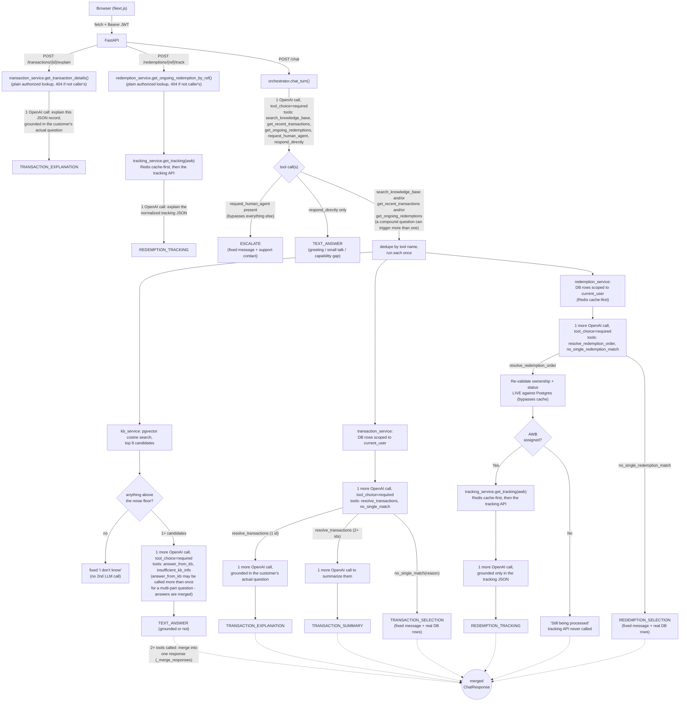

# AI Customer Support Assistant

A full-stack support chat for a platform where customers buy and sell gold. It answers general questions from an approved knowledge base, looks up a customer's own transaction data through authorized backend tools rather than letting an LLM guess, and tracks the shipment status of a customer's physical gold redemption orders.

- **Frontend**: Next.js (App Router, TypeScript), styled with Tailwind CSS + shadcn/ui — see [frontend/README.md](frontend/README.md)
- **Backend**: FastAPI (Python) — see [backend/README.md](backend/README.md)
- **Database**: PostgreSQL + [pgvector](https://github.com/pgvector/pgvector) (semantic search over the FAQ knowledge base)
- **Cache**: Redis (redemption order discovery + shipment tracking lookups — see "Redis caching" below)
- **Observability**: OpenTelemetry traces exported to Grafana Cloud — see "Observability" below
- **LLM provider**: OpenAI (`gpt-4o-mini` for chat/tool-calling, `text-embedding-3-small` for embeddings) — configurable via `backend/.env`

## Demo

📹 [v1.0 demo video](https://drive.google.com/file/d/12BKAPZOa-xUKVDwou-XT7dRsfrUrzRAd/view?usp=sharing)
📹 [Support demo v2](https://drive.google.com/file/d/1_6J23VUsNVTcfVrIHJmptU-d7e-5ujrf/view?usp=sharing)
📹 [Transaction support demo v2](https://drive.google.com/file/d/1vfzhuiHsM3CjKRgFN3n16cleIoKInns6/view?usp=sharing)

## Quick start

```bash
docker compose up -d db redis                # Postgres + pgvector on :5433, Redis on :6380

cd backend
python3 -m venv .venv && source .venv/bin/activate
pip install -r requirements.txt
cp .env.example .env                          # set OPENAI_API_KEY and a real JWT_SECRET
alembic upgrade head
python -m scripts.seed                        # seeds users, transactions, redemption orders, and embeds the FAQ articles
uvicorn app.main:app --reload --port 8000

# in a second terminal
cd frontend
npm install
cp .env.example .env.local
npm run dev                                   # http://localhost:3000
```

Full setup/run/test details live in each service's own README. If you're using Claude Code, `.claude/skills/setup-repo/` has this same bootstrap as a skill it can run for you.

## The three core flows

**General support question** ("How do I sell my gold?") → the backend embeds the question, searches the knowledge base with pgvector, and answers using *only* the retrieved content. If nothing matches well enough, it says so instead of guessing.

**Transaction question** ("Why did my last purchase fail?") → the backend fetches the authenticated customer's own recent transactions (never anyone else's), tries to work out from their wording which single transaction they mean, and either explains that one directly or — if it's genuinely unclear — shows the list as clickable cards for the customer to pick from.

**Redemption order tracking** ("Where is my order?") → the backend fetches the customer's own *ongoing* (not yet delivered, not failed/cancelled) physical gold redemption orders, resolves which one they mean the same way as the transaction flow, re-validates ownership live against the database immediately before use, and — if a shipment tracking number (AWB) has been assigned — looks up its live status (cached in Redis) and explains it. An order with no AWB yet is told to the customer plainly ("still being processed"), never treated as an error.

## Architecture



Postgres (with pgvector) sits behind the backend; nothing in the diagram above ever gives the model direct database access — every arrow into Postgres is a plain Python query the server runs itself. (The `/chat/stream`, `/transactions/{id}/explain/stream`, and `/redemptions/{ref}/track/stream` SSE endpoints follow this same routing/dispatch logic with a judge-then-generate split so the final answer can stream token-by-token — see `docs/chat-tool-calling-flow.md` for that variant.)

### The trust boundary: how tool-calling is used, and why

The rule behind most design decisions here: **the LLM never touches the database directly, and never decides whose data it's looking up.** `tools_schema.py` defines every tool the model can call, and none accept a `user_id` — `get_recent_transactions` and `get_ongoing_redemptions` both take zero arguments, since the authenticated user is bound server-side from the JWT (`get_current_user`) before any tool runs. When the model picks specific transaction(s) (`resolve_transactions(transaction_ids)`) or a redemption order (`resolve_redemption_order(order_ref)`), each id/ref is checked against a dict built from the list *already fetched for that user* — never a fresh, unscoped query; an unrecognized or injected value is silently dropped, never a database hit. For redemption orders specifically, ownership and current trackable status are re-checked **live against Postgres** a second time, immediately before the tracking API is ever called — the cached discovery list is fine for display, but the action step never trusts a snapshot that could be a few seconds stale. Every LLM call only ever sees a small, pre-fetched, already-authorized slice of data (a few retrieved articles, one or more transaction records, or one order's normalized tracking data) and is told to answer only from it.

**Two decision points, eleven tool schemas.** Call 1 (`tool_choice="required"`) always picks at least one of `search_knowledge_base`, `get_recent_transactions`, `get_ongoing_redemptions`, `request_human_agent`, or `respond_directly` — intent routing, with no free-form-reply escape hatch (an earlier `tool_choice="auto"` version could skip every tool and answer, or fabricate, from general knowledge). A compound question can make it pick more than one tool at once, dispatched (deduped by tool name) and merged (see `_merge_responses`) rather than acting on only the first. Each real branch then forces a second tool choice rather than letting the model reply in plain text: the KB branch picks `answer_from_kb` vs `insufficient_kb_info`, the transaction branch picks `resolve_transactions` vs `no_single_match`, the redemption branch picks `resolve_redemption_order` vs `no_single_redemption_match`. This pattern exists because an earlier version let the model "just reply" when unsure, and it would narrate the whole transaction list back as Markdown prose instead of using the card UI. Forcing a tool choice means the model's only way to communicate is a shape the server already validates — fixed UI-facing strings (`"Here are your recent transactions:"`, `"Which order would you like to track?"`, etc.) are chosen by the server, never written by the model. Every response is a `{type, message, data}` shape (`schemas/chat.py`); the frontend switches on `type` and never parses prose to figure out what happened.

### Embeddings and knowledge-base retrieval

An embedding is a 1536-number vector (OpenAI `text-embedding-3-small`) where semantically similar text lands close together, measured by cosine similarity. At seed time each FAQ's **question text** is embedded into a `pgvector` column; at query time the customer's raw message is embedded the same way and matched with `ORDER BY embedding <=> :query LIMIT 8` — no separate vector database.

Retrieval used to gate everything on one number: below a similarity threshold, decline; above it, answer. That broke on compound questions — "do I need to pay extra if I purchase gold?" scored *higher* against "How do I buy gold?" than against "What fees do you charge?" (the actually-relevant article), because "purchase gold" dominated the embedding over the weaker "pay extra" signal — so the real answer never even made the top-3 candidates. Fixed by decoupling retrieval from relevance: `kb_min_similarity` (0.30) is now just a noise floor for the candidate pool, widened to top 8; a forced tool choice (`answer_from_kb` / `insufficient_kb_info`) then has the model judge relevance from the actual article content, not a raw score. A real bonus of this: a previously-unsolved case ("Is my gold insured against theft?", which scored 0.637 — just under the old 0.65 cutoff) now resolves correctly too, since the model can tell the "Is my investment insured?" article answers it even though the wording differs.

Two earlier bugs in how articles get embedded, also worth noting: embedding `question + answer` combined diluted the vector enough that an exact-match question scored only 0.74 against itself (fixed by embedding the question alone → 1.0); and letting the model rephrase the query before embedding hurt more than it helped (measured with `scripts/eval_kb.py`, an 11-query standing eval) — "How can I exchange my gold for cash?" → "how to exchange gold for cash" dropped a genuine match from 0.799 to 0.733 (fixed by always embedding the customer's raw message). No ANN index (HNSW/IVFFlat) yet — brute-force is simpler and fast enough at ~18 articles.

### Conversations, sessions, and why the backend stays stateless

Conversations and their messages are persisted server-side in Postgres (`conversations`/`messages` tables) — the backend is the sole owner of this state. The **conversation id lives in the URL** (`?c=<uuid>`, minted on login or "New chat"); each turn is appended to the database before the response is returned, and the frontend hydrates a conversation's history via `GET /conversations/{id}` rather than keeping its own copy, so it survives a refresh or a device switch. A per-conversation title is generated from the first message via a cheap LLM call, and per-message cost/model data feeds the admin cost dashboard (see below).

### Redis caching (redemption order tracking)

Two things are cached, both behind a single shared client (`app/services/cache.py`) that every call site wraps in `try/except redis.RedisError` — a Redis outage degrades the feature to "always re-fetch," it never breaks it:

- **The ongoing-orders discovery list** (`redemption_service.get_ongoing_redemptions`) — 45s TTL for a real result, 20s for an empty one (negative caching, so repeated "no orders" chat retries don't keep re-querying Postgres).
- **The AWB tracking lookup** (`tracking_service.get_tracking`) — 90s TTL, plus a longer-lived "stale shadow" copy (24h TTL) used only as a fallback if the tracking API call fails, so a customer gets a labeled-stale answer instead of a hard error. A short request-coalescing lock (~8s) also prevents two near-simultaneous requests for the same AWB from firing duplicate upstream calls.

**Deliberately never cached**: `get_ongoing_redemption_by_ref` — the function that re-validates ownership and current status immediately before actually tracking a specific order — always reads Postgres live. The discovery list can be a few seconds stale; the action step never is.

Locally this is the `redis` service in `docker-compose.yml` (port `6380`, chosen to avoid colliding with a dev machine's own default Redis, same reasoning as Postgres's `5433` remap). **For a cloud deployment**, point `REDIS_URL` at a real hosted instance instead (e.g. Redis Cloud, Upstash) — the code is provider-agnostic, it just calls `redis.Redis.from_url(settings.redis_url)`, so nothing changes beyond the connection string. Without a working `REDIS_URL` in production, the feature still works correctly, it simply never gets a cache hit (every lookup falls through to Postgres/the tracking API, per the graceful-degradation design above).

### Observability: OpenTelemetry tracing to Grafana Cloud

Every chat turn (streaming or not) is wrapped in one root `chat_turn` span, with nested child spans for intent routing, whichever tool ran (`kb_search_and_judge` / `transaction_lookup_and_resolve` / `redemption_lookup_and_resolve`), and the final answer-generation call. `llm_client.py`'s single `_record_call` choke point enriches whichever span is currently active with the model, token counts, and cost for that call — the same data already tracked for the per-message cost dashboard, just also attached to the trace.

This is a no-op by default: with no `OTEL_EXPORTER_OTLP_ENDPOINT` configured, OpenTelemetry's default no-op `TracerProvider` stays in place and every span-related call is a cheap do-nothing — local dev without Grafana credentials and the test suite are both unaffected, no new required parameter exists anywhere. When configured, spans are exported in batches after they complete (`BatchSpanProcessor`) via OTLP/HTTP, not streamed continuously.

**Local vs cloud is one setting**: `ENVIRONMENT` (`local` by default, set to `cloud` in the deployed backend's own env vars) becomes the `deployment.environment` resource attribute on every trace, alongside `service.name=ai-support-assistant-backend` — so traces from a laptop and traces from real deployed traffic land in the same Grafana Cloud account, filterable by origin, using the exact same `OTEL_EXPORTER_OTLP_ENDPOINT`/`OTEL_EXPORTER_OTLP_HEADERS` credentials in both places. View them in Grafana Cloud under **Explore → select the Tempo data source (not the default Prometheus one) → search by Service Name or Span Name**.

### Admin dashboard

A role-gated (`ADMINISTRATOR`) area at `/admin`, built with the same Tailwind CSS + shadcn/ui components as the customer chat UI (searchable/sortable data tables via `@tanstack/react-table`, a `Sheet`-based mobile nav, a `Dialog`-based profile modal): **Users** (per-user transaction/redemption/conversation counts), **Transactions**, **Redemptions**, **Conversations** (with a read-only transcript viewer per conversation, reusing the same chat message components in a non-interactive mode), **Costs** (spend by model, by query category, and top conversations by cost — sourced from the same per-message cost data the tracing spans are enriched with), and **FAQ Articles** (create/delete knowledge-base entries, embedding a new one immediately on creation).

## Testing

```bash
cd backend && pytest
```

89 tests, all deterministic and offline (every OpenAI call is monkeypatched at the `llm_client` seam — no network access or API key needed). The two highest-value ones:

- **`test_transaction_authz.py`** — user A's JWT can fetch their own transaction (200) but never user B's (404), and `/transactions/recent` never returns another user's rows. This is the literal trust boundary described above, under test.
- **`test_kb_grounding.py`** — asserts the below-threshold path returns `grounded: false` *and* that the second ("write the grounded answer") LLM call is never invoked in that case — the no-hallucination guard is tested as a structural fact, not just a prompt.

Beyond `pytest`, `docs/real-scenario-testing.md` documents a separate, real (non-mocked) eval across FAQ, transaction, redemption-tracking, and out-of-scope scenarios (70 questions as of the latest run, 66/70 passing — see that doc for the full per-category breakdown and the specific failures found), run by hand after touching routing/prompt code, with a timestamped results snapshot and an expected-vs-actual confusion matrix written to `backend/scripts/fixtures/eval_reports/` each run. See that doc for the methodology, and [How to Evaluate and Select the Right LLM for Your GenAI Application](https://www.freecodecamp.org/news/how-to-evaluate-and-select-the-right-llm-for-your-genai-application/) for general background on LLM evaluation approaches this drew on.

## What I would improve for production

- **Security**: replace the no-password mock login with real authentication; add rate limiting on `/chat` (each call can trigger 1–3 OpenAI requests); add request size limits and stricter CORS in production.
- **Observability**: real distributed tracing now exists (OpenTelemetry → Grafana Cloud, see above), and per-`conversation_id` JSONL logging with per-call token/cost tracking still runs alongside it (`backend/app/services/session_log.py`) — but there's no alerting/latency-SLO dashboard on top of the traces yet, and `scripts/eval_faq_coverage.py`'s KB-grounding-rate report over a 180-question fixture is still file-based and run by hand, not a standing metric.
- **Scalability**: Redis caching now exists for redemption order discovery and tracking lookups (see above), but conversation/message reads still hit Postgres directly on every request — the same cache-aside pattern could extend there; add Redis pub-sub to push live updates to the admin dashboard instead of polling; add an HNSW index on `support_articles.embedding` once the KB is large enough that brute-force search matters.
- **Retrieval quality**: chunk longer articles instead of one-embedding-per-FAQ, add reranking over the candidate pool for large knowledge bases (fine to skip at ~18 articles, matters once it's hundreds), and surface citations in the UI (the backend already returns `sources`, the frontend doesn't show them yet).
- **Cost**: cache embeddings for repeated/similar queries; consider a cheaper/faster model for the intent-routing and resolve steps versus the final answer-generation step.
- **Escalation**: a "hand off to a human agent" action when the KB has no grounded answer twice in a row, or when a transaction explanation can't be generated — right now the fallback message just apologizes.
- **Multi-tool merge coverage**: `_merge_responses`' "prefer a transaction-shaped base" rule doesn't yet recognize `REDEMPTION_*` response types (see `docs/chat-tool-calling-flow.md`) — a compound question spanning both transactions and redemption tracking in one turn currently loses the redemption card rendering, same class of accepted tradeoff as the existing combined-question limitations, just not extended to this newer tool pair.
