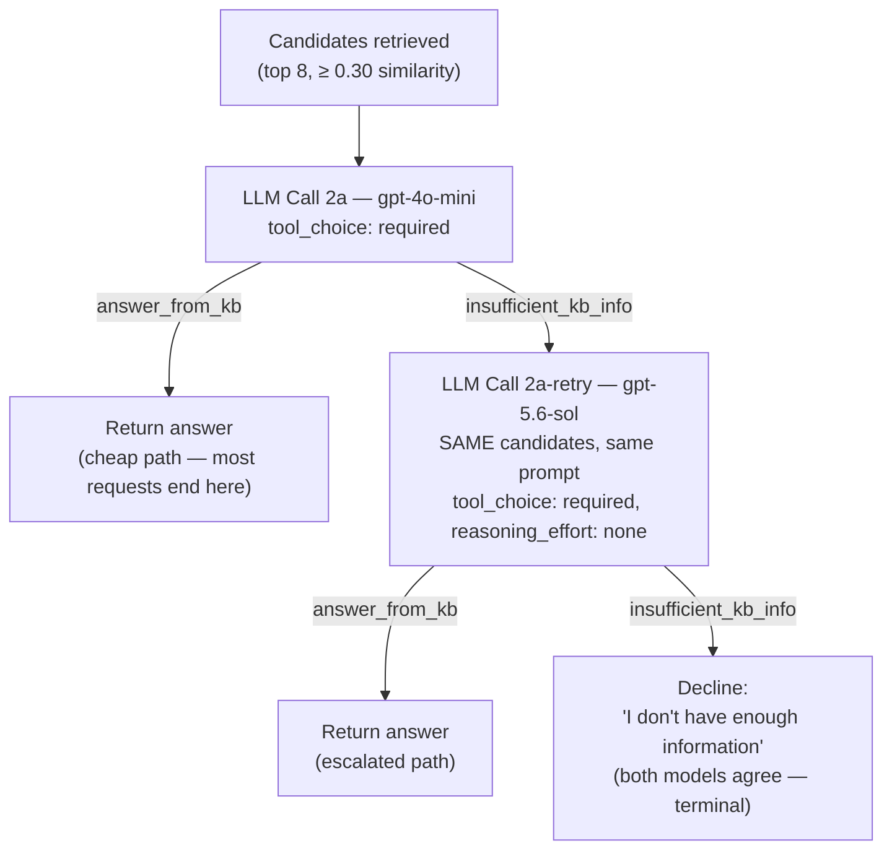

# Proposal: Escalate-on-Decline Cascade for KB Judgment

**Status: design only, not implemented.** No code has been changed in response to this document. It exists to record the reasoning and the measured evidence behind a proposed next step, so implementation (if approved) starts from an already-validated design instead of a guess.

## Where this fits in the current architecture

The system doesn't do context-stuffing and was never a "cram all N FAQs into one prompt" design — it's been retrieval-based (pgvector, `top_k=8`) since the first version (see `docs/embedding-architecture.md`), and the judgment step already uses structured tool-choice rather than free text (see `docs/chat-tool-calling-flow.md`). That matters for this proposal: a generic "small model + confidence threshold + escalate" cascade doesn't map cleanly onto this codebase, because we don't have — or need — a confidence *score* anywhere in it. What we already have is better-suited to a cascade than a raw confidence number would be.

## Why a confidence-threshold cascade doesn't fit, and what we'd use instead

The classic cascade pattern looks like:

```
Retrieval → top-k candidates → small model → [high confidence: accept] / [low confidence: escalate to large model]
```

Its biggest weakness in practice is that small models are frequently *miscalibrated* — confidently wrong exactly on the cases where retrieval handed them weak candidates, which means "high confidence" doesn't reliably mean "correct." Trusting a self-reported confidence number requires labeled eval data and ongoing calibration work just to know if the threshold is doing anything real.

Our `_handle_knowledge_base` judgment step (`app/services/orchestrator.py`) doesn't produce a confidence score at all — it forces a **binary tool choice** between `answer_from_kb` and `insufficient_kb_info` (`tool_choice="required"`, see `tools_schema.py`). That decision is discrete, not a fuzzy number, and it was deliberately built this way for a different reason (to stop the model from narrating candidate content as ungoverned prose — see the root README's trust boundary section). It turns out to double as exactly the routing signal a cascade needs, without any calibration problem: **`insufficient_kb_info` from the cheap model *is* the escalation trigger.** No threshold to tune, no confidence-score reliability question — the model already told us, in a governed format, whether it found an answer.

## Proposed design



Unlike the generic diagram's open question ("what if the strong model is also unsure?"), this has a defined terminal state already: if the escalated model *also* declines, we return the existing, already-implemented decline message. No dead end.

Implementation would reuse infrastructure that already exists (not hypothetical): `llm_client.chat_completion`'s `model`/`reasoning_effort` overrides and `_handle_knowledge_base`'s `judgment_model`/`judgment_reasoning_effort` parameters (currently wired for the experiment scripts, not the live path — see `docs/judgment-model-comparison.md`) are the exact mechanism this needs; the change would be calling `_handle_knowledge_base`'s judgment step a second time, with the stronger model, only inside the `insufficient_kb_info` branch.

## Advantages (grounded in what we measured, not projected)

- **No calibration problem.** The escalation trigger is a discrete tool decision, not a confidence score — sidesteps the main weakness of the generic pattern entirely.
- **Cost stays low.** From the real 180-question run: `gpt-4o-mini` alone declined 21/180 (11.7%). Escalating only those: ~21 × ~$0.0035/call ≈ $0.07, on top of the $0.036 baseline ≈ **~$0.11 total** — about **6x cheaper** than always using the strong model ($0.662, per `docs/judgment-model-comparison.md`), while positioned to recover most of the same fixable gap (that same experiment showed `gpt-5.6-sol` resolving 12/16 previously-confirmed judgment failures).
- **Latency cost is isolated to the minority path.** Only the ~12% of requests that decline pay for a second call; the other ~88% see no change. This is a smaller relative hit than in a single-call architecture, since this system already makes 2+ calls per request minimum.
- **Reuses existing code**, not new infrastructure — the override plumbing is already built and tested (`tests/test_kb_grounding.py`, `tests/test_chat_routing.py` already mock `chat_completion` with a `model` kwarg).

## Disadvantages / what this does *not* fix

- **Doesn't touch retrieval misses.** The measured "spread" case (`docs/embedding-architecture.md`) — a question whose key term only exists in the answer text, never the question — means the correct article never reaches *either* model's candidate list. Escalating the judgment model changes nothing when the input to both models is the same incomplete candidate set. That failure mode needs the separate, not-yet-implemented answer-embedding fix, not this cascade.
- **Real dollar cost, even if small.** $0.11 vs $0.036 is still a ~3x increase over doing nothing — worth confirming is actually wanted before shipping, especially at higher request volume than a test fixture.
- **Two-call tail latency on declines.** The customer waiting for a decline (arguably the case where they're already frustrated) now waits for two model calls instead of one before hearing "I don't know." Worth checking this against real latency budgets before adopting, not just cost.
- **`gpt-5.6-sol` only supports tool-calling with `reasoning_effort=none`** on the Chat Completions API we use — meaning we'd be escalating to a bigger model with its actual reasoning capability turned off. We measured a real gain even in this mode (0/16 → 12/16 on known failures), but the ceiling with real reasoning enabled (via the separate Responses API, not attempted) is unknown — see `docs/judgment-model-comparison.md`'s "what I'd try next."
- **New dependency on a model whose pricing was user-supplied, not fetched from a stable source** (`pricing.py`'s gpt-5.6 entries are dated August 2026 promotional rates) — cost projections here would need re-checking if that pricing changes.

## Scaling: how this — and retrieval — should change as the FAQ count grows

The current corpus is 18 articles. The right next move depends on *question difficulty*, not article count alone — going from 18 to 500 straightforward FAQ lookups mostly stresses retrieval precision (finding the right article among more similar ones), not the judgment model's reasoning ability.

| FAQ count | Retrieval | Judgment / cascade |
|---|---|---|
| **~18 (now)** | pgvector exact search, `top_k=8`, no index — already correctly sized for this scale (see `docs/embedding-architecture.md`) | `gpt-4o-mini` alone is reasonable; escalate-on-decline cascade is optional polish, not urgent — the $0.626/180 gap to "always strong" is trivial at this volume either way |
| **~100** | Still fine without an ANN index; worth re-running `eval_faq_coverage.py` to check the candidate pool isn't getting noisier as more similar articles exist | Cascade becomes more worth having — more articles usually means more paraphrase collisions for the cheap model to stumble on |
| **~1,000+** | Watch for embedding similarity alone degrading among many topically-similar entries — the first fix here is usually a reranking step (fetch a wider pool, e.g. top 20-30, then rerank) or hybrid keyword+embedding search, **not** a bigger judgment model. An HNSW/IVFFlat index becomes worth the setup cost for query speed at this scale | Keep escalation as a safety net for the genuinely ambiguous tail, calibrated against real measured failures (via `eval_faq_coverage.py`-style runs) — not a routine default path. Log every escalation; a recurring pattern of escalated questions usually means the KB is missing content, which fixing (adding a proper FAQ entry) resolves more permanently than routing around it with a bigger model. |

The throughline, consistent with this project's "don't overfit" principle already recorded in memory: let *measured* failures decide when to add complexity (retrieval reranking, then cascade, then a bigger default model, in that order) — not question count, and not this document's projections standing in for a real run.

## Before implementing

- Re-run `eval_faq_coverage.py` (or a variant of it) with the actual escalate-on-decline logic wired in, to get a real number instead of the $0.11 projection above.
- Decide whether the ~2x latency tail on declines is acceptable for this product's UX.
- Confirm `gpt-5.6-sol` pricing is still current before trusting the cost projection at higher volume.
