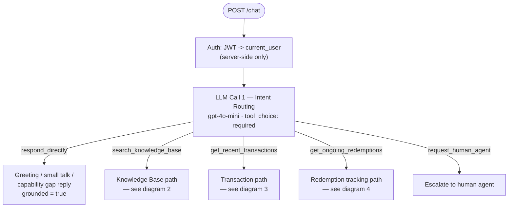
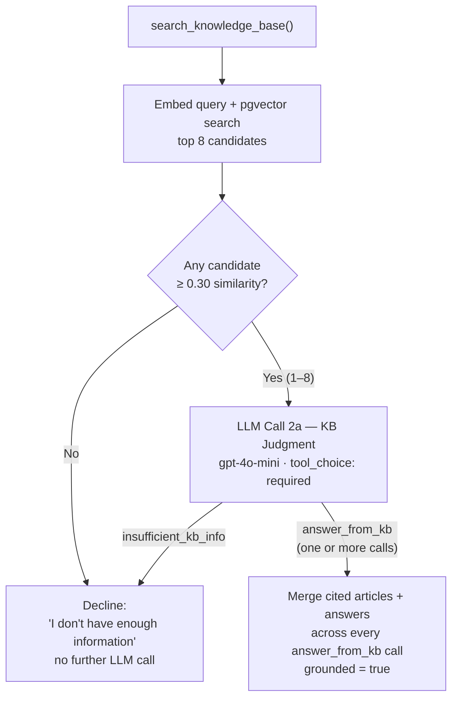
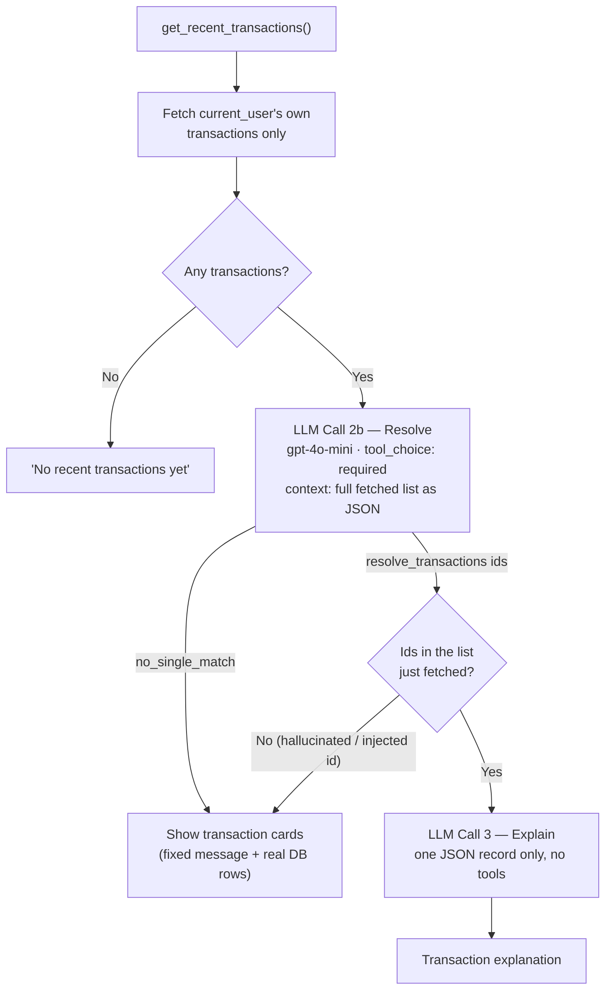
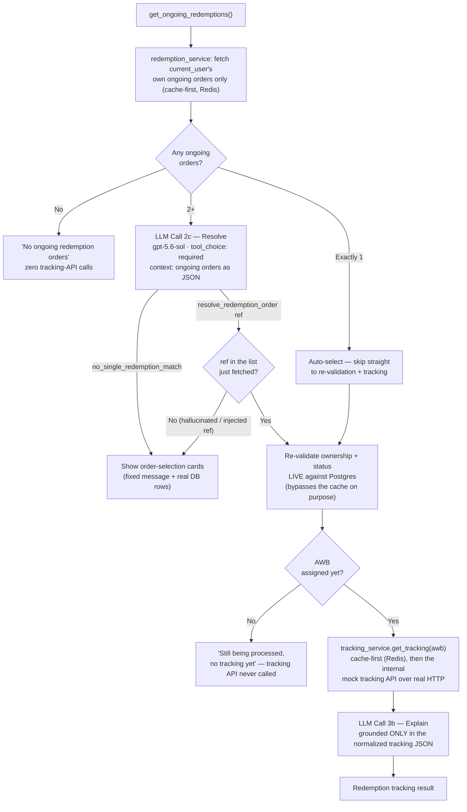
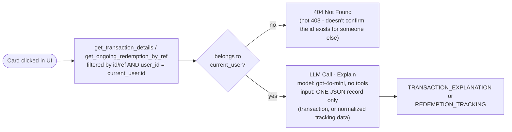

# Chat & Tool-Calling Flow

How `POST /chat` (and its streaming counterpart, `POST /chat/stream`) actually decides what to do internally: which model runs at each step, which tools it can call, and how the result gets shaped into a response. This reflects the code as of 2026-08-31 (`backend/app/services/orchestrator.py`), including the intent-routing fix, `respond_directly` (replacing the old "no tool called" escape hatch), the multi-article merge fix for compound KB questions, the redemption order tracking path, and the streaming variant. See `docs/real-scenario-testing.md` for the 70-question eval this architecture is measured against, and `docs/faq-coverage-testing.md`/`docs/judgment-model-comparison.md` for the earlier, narrower evals that found the KB judgment issues.

## Model details

| Step | Default model | Tools available | `tool_choice` | Can be overridden? |
|---|---|---|---|---|
| 1. Intent routing | `gpt-4o-mini` (`settings.chat_model`) | `search_knowledge_base`, `get_recent_transactions`, `get_ongoing_redemptions`, `request_human_agent`, `respond_directly` | **`required`** | Yes — `routing_model` / `routing_reasoning_effort`, experiment-only (see `scripts/eval_routing_model.py`) |
| 2a. KB judgment | `gpt-4o-mini` | `answer_from_kb`, `insufficient_kb_info` | `required` | Yes — `judgment_model` / `judgment_reasoning_effort`, experiment-only (see `docs/judgment-model-comparison.md`) |
| 2b. Transaction resolve | `gpt-5.6-sol` (`settings.resolve_model`) | `resolve_transactions`, `no_single_match` | `required` | No |
| 2c. Redemption order resolve | `gpt-5.6-sol` (`settings.resolve_model`) | `resolve_redemption_order`, `no_single_redemption_match` | `required` | No |
| 3a. Transaction explain | `gpt-4o-mini` | *(none — plain text generation)* | n/a | No |
| 3b. Redemption tracking explain | `gpt-4o-mini` | *(none — plain text generation, grounded only in the normalized tracking JSON)* | n/a | No |
| Embeddings (seed + query) | `text-embedding-3-small` | n/a | n/a | No |

**`tool_choice: required` at the routing step (step 1)** is the most significant change from the original design: the model used to be allowed to skip calling a tool entirely and just answer in free-form prose, which is where every real routing bug found this session came from (see `docs/real-scenario-testing.md`'s "what this run found"). `respond_directly` replaces that escape hatch with an explicit tool - genuine greetings, small talk, and capability gaps (e.g. "how much gold do I own") now go through it instead of silent free-form text, so the router can never respond without picking one of five defined options.

Every call goes through the single seam `app/services/llm_client.py`, which is also where token usage and cost get logged per-session (`app/services/session_log.py`, `app/services/pricing.py`) - or, for the streaming path, via an explicit `TurnMetrics` object rather than that same per-session logging (see "Streaming variant" below for why). Since 2026-08-31, that same seam also enriches whichever OpenTelemetry span is currently active (model, tokens, cost, tool calls) - see the root README's "Observability" section for the tracing layer wrapped around these steps.

**The authorization boundary, shown as the box at the top of the diagram**: `current_user` is decoded from the request's JWT (`get_current_user`) *before* any of this runs. No tool schema below accepts a `user_id` parameter — the model can never supply, guess, or be prompt-injected into supplying one. See the root README's "trust boundary" section for the full reasoning.

## The flow

Split into three views — one overview plus one detail diagram per branch — rather than a single dense graph.

### 1. Overview: what the first LLM call decides

`tool_choice: required` means the model must always pick at least one of these five - there is no sixth "just answer in free text" option. `respond_directly`'s own tool description explicitly forbids using it as an uncertainty fallback ("never call this just because you are unsure... uncertainty is not a request for a human" applies the same idea to `request_human_agent`) - both were tightened after being observed doing exactly that. `get_ongoing_redemptions` was added alongside the original four when redemption order tracking shipped - its own tool description explicitly distinguishes it from `get_recent_transactions` ("this is separate... covers BUY/SELL/RECURRING_BUY activity, not physical delivery/shipment status"), since both tools cover the vague word "order" and a real-scenario eval row (`docs/real-scenario-testing.md`) later showed that ambiguity can still bite a compound question that uses generic "order" language.

**"At least one," not "exactly one":** a compound question ("check my transactions **and** tell me the fees you charge") correctly makes the model issue *two* tool calls in a single response - `get_recent_transactions` and `search_knowledge_base` together. Every tool call in the response is dispatched (`request_human_agent` present anywhere bypasses everything else, per its own description; duplicate calls to the same tool are deduped to one, see `_dedupe_real_tool_calls`), and the results are merged into one `ChatResponse`: whichever result is transaction-shaped is used as the base (so the frontend still gets `type`/`data` to render cards or a detail panel), with every other result's message text appended after it. Before this was fixed, only `tool_calls[0]` was ever acted on and the rest were silently dropped - a real-scenario eval (`docs/real-scenario-testing.md`) measured this happening on ~90% of realistic combined questions before the fix. **Known gap, not yet solved generically:** the merge's "prefer a transaction-shaped base" rule doesn't recognize `REDEMPTION_*` response types, so a compound question spanning both `get_recent_transactions` and `get_ongoing_redemptions` in one turn shows the transaction as the rendered card and the redemption info as appended text only - same class of accepted tradeoff as the `tool_calls[0]` fix above, just not extended to this newer pair of tools yet.

### 2. Knowledge base path

*Sources are validated against the candidates just fetched — never a fresh, unscoped lookup by whatever id the model names.*

*A compound question ("how do I buy **and** sell gold?") can make the model issue **multiple separate** `answer_from_kb` calls - one per sub-question - instead of one call citing every relevant article together, even though the schema already supports citing several ids per call. The code merges every `answer_from_kb` call it receives (concatenating their answer text, unioning their cited ids) rather than acting on only the first or last one seen - see `docs/real-scenario-testing.md`'s `faq_combined` category, which is what caught this.*

### 3. Transaction path

*A model-supplied id is only ever checked against the list already fetched for this user — never re-queried against the database, so a wrong or malicious id can't leak another customer's transaction.*

### 4. Redemption order tracking path

Deliberately mirrors the transaction path's shape (fetch owned data → forced-choice resolve → re-validate → explain), with two differences specific to this tool: (1) the *discovery* list is cache-backed for a short TTL, but the step that actually re-validates and acts on one specific order **always reads Postgres live**, never the cache - see the root README's "Redis caching" section for exactly why; (2) an order with no AWB yet is a normal, expected state (`awb_available: false`), not an error - the tracking API is never called for it, by design, not as a fallback.

### Error handling (all four paths)

Not drawn as edges above to keep the diagrams readable, but applies uniformly: any exception in an LLM call, the DB, the tracking API, or an unsupported tool name is caught, logged server-side with the full traceback, and returned to the client as a generic `ERROR` response — never a stack trace or internal detail. The redemption path additionally degrades gracefully on a tracking-API-specific failure (timeout, malformed response, or a live 401/5xx after retries) by falling back to a longer-lived stale cache entry labeled `stale: true`, rather than an `ERROR` response, if one exists.

## A separate, simpler path: clicking a card

`POST /transactions/{id}/explain` and `POST /redemptions/{order_ref}/track` (triggered by clicking a card in the UI, not by typing a message) **do not go through any of the above** — no intent routing, no tool-calling at all:

This is deliberate: a card click is already an unambiguous, explicit action, so routing it through NL intent classification would add latency, cost, and a hallucination surface for no benefit (see `explain_transaction`'s and `track_redemption_order`'s docstrings in `orchestrator.py` - the latter reuses the exact same "already-authorized, already-fetched record" shape, just with a live re-validation step in front of it since tracking is the more sensitive action).

If the request includes a `conversation_id`, the click is still persisted as a real turn in that conversation (a synthetic user message - "What can you tell me about transaction X?" / "Where is my {product} order?" - plus the explanation) so a later typed follow-up ("why is it pending?") has the clicked record in its history, exactly as if the customer had typed the question. This does not add any intent-routing step to the click itself.

## Streaming variant

`POST /chat/stream`, `POST /transactions/{id}/explain/stream`, and `POST /redemptions/{order_ref}/track/stream` mirror everything above, with one structural difference: any step that generates free text for the customer (transaction explain/summary, the KB answer, the `respond_directly` reply, and the redemption tracking explanation) is split into **judge, then generate**, so the generation half can stream token-by-token instead of arriving as one blocking response:

- `respond_directly` and `answer_from_kb` keep the same tool-calling judgment step (deciding *that* this is small talk, or *which* articles apply), but no longer carry the reply/answer text in their arguments - a separate plain-content call (streamed via `llm_client.stream_chat_completion`) writes the actual text afterward, using a small dedicated prompt (`small_talk_reply.j2`, `kb_answer_stream.j2`).
- Transaction explain/summary were already plain content generation, so they stream directly with no restructuring.
- Redemption tracking's order discovery, resolve, live re-validation, and the cache/tracking-API lookup are all blocking (none of them generate free text) - only the final explanation streams, same shape as the transaction path.
- Fixed/lookup responses with nothing to generate (transaction list, redemption selection list, escalation, KB decline, "still processing, no AWB yet", errors) are sent as a single immediate event - there's nothing to stream.

This is a fully parallel implementation (`orchestrator.StreamedChatTurn`/`chat_turn_stream`, `tools_schema.ALL_TOOLS_STREAM`) - the non-streaming functions described above are untouched, still used by `/chat`, both eval scripts, and every non-streaming test. Two things about it are non-obvious enough to call out:

- **No shared session/cost tracking with the non-streaming path.** `TurnMetrics` is a plain object held directly on `StreamedChatTurn`, passed explicitly into every LLM call it makes, rather than the contextvar-based `turn_scope()`/`session_log.session_scope()` the non-streaming path uses. Contextvars don't survive being set/reset across the different worker-pool threads a sync generator driven by Starlette's `StreamingResponse` can run on - this was a real bug found by testing the streaming endpoint live, not a design preference. Streamed turns also don't get a JSONL session log entry (observability gap only; persistence goes through `conversation_service`, unaffected).
- **Every streaming request opens its own SQLAlchemy session on a dedicated worker thread**, rather than using the `get_db()` dependency at all - the same threading issue extends to `Session` objects, which broke (and in one variant, hung) when a `db` handed off between threads was used mid-stream. See `routers/chat.py`'s `chat_stream` for the full comment.
