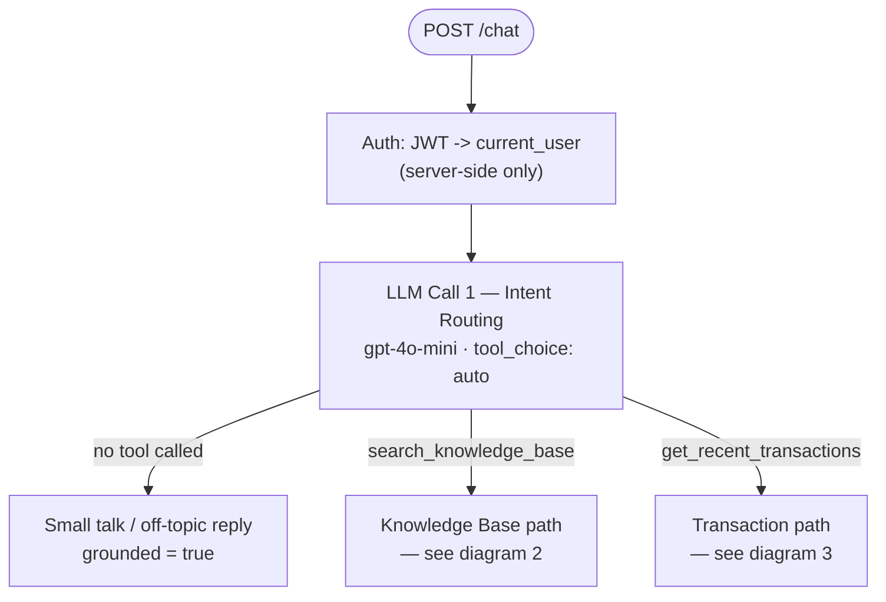
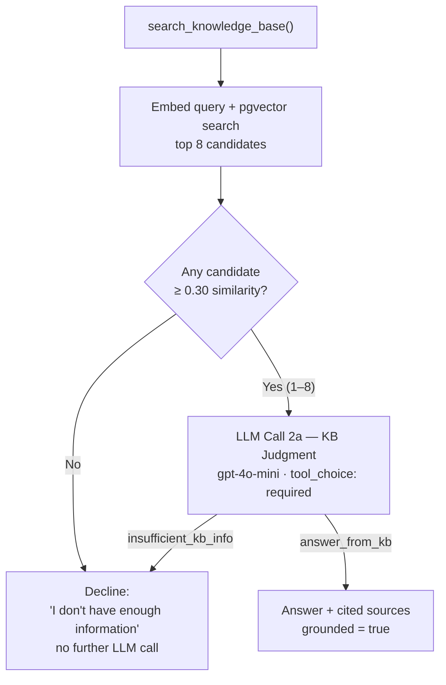
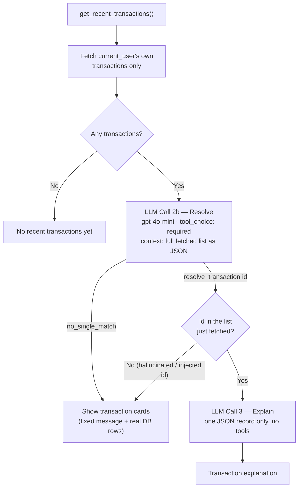
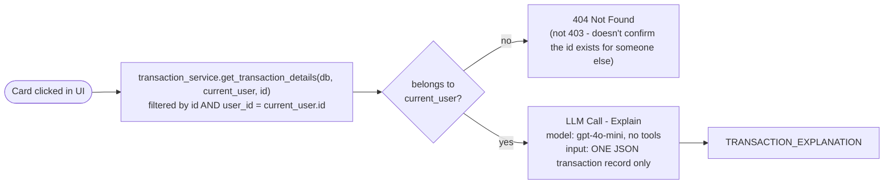

# Chat & Tool-Calling Flow

How `POST /chat` actually decides what to do internally: which model runs at each step, which tools it can call, and how the result gets shaped into a response. This reflects the code as of 2026-08-29 (`backend/app/services/orchestrator.py`), including the intent-routing fix and the generalized inference prompt for KB judgment (see `docs/faq-coverage-testing.md` and `docs/judgment-model-comparison.md` for how these were found).

## Model details

| Step | Default model | Tools available | `tool_choice` | Can be overridden? |
|---|---|---|---|---|
| 1. Intent routing | `gpt-4o-mini` (`settings.chat_model`) | `search_knowledge_base`, `get_recent_transactions` | `auto` | No |
| 2a. KB judgment | `gpt-4o-mini` | `answer_from_kb`, `insufficient_kb_info` | `required` | Yes — `judgment_model` / `judgment_reasoning_effort`, experiment-only (see `docs/judgment-model-comparison.md`) |
| 2b. Transaction resolve | `gpt-4o-mini` | `resolve_transaction`, `no_single_match` | `required` | No |
| 3. Transaction explain | `gpt-4o-mini` | *(none — plain text generation)* | n/a | No |
| Embeddings (seed + query) | `text-embedding-3-small` | n/a | n/a | No |

Every call goes through the single seam `app/services/llm_client.py`, which is also where token usage and cost get logged per-session (`app/services/session_log.py`, `app/services/pricing.py`).

**The authorization boundary, shown as the box at the top of the diagram**: `current_user` is decoded from the request's JWT (`get_current_user`) *before* any of this runs. No tool schema below accepts a `user_id` parameter — the model can never supply, guess, or be prompt-injected into supplying one. See the root README's "trust boundary" section for the full reasoning.

## The flow

Split into three views — one overview plus one detail diagram per branch — rather than a single dense graph.

### 1. Overview: what the first LLM call decides

### 2. Knowledge base path

*Sources are validated against the candidates just fetched — never a fresh, unscoped lookup by whatever id the model names.*

### 3. Transaction path

*A model-supplied id is only ever checked against the list already fetched for this user — never re-queried against the database, so a wrong or malicious id can't leak another customer's transaction.*

### Error handling (all three paths)

Not drawn as edges above to keep the diagrams readable, but applies uniformly: any exception in an LLM call, the DB, or an unsupported tool name is caught, logged server-side with the full traceback, and returned to the client as a generic `ERROR` response — never a stack trace or internal detail.

## A separate, simpler path: clicking a transaction card

`POST /transactions/{id}/explain` (triggered by clicking a card in the UI, not by typing a message) **does not go through any of the above** — no intent routing, no tool-calling at all:

This is deliberate: a card click is already an unambiguous, explicit action, so routing it through NL intent classification would add latency, cost, and a hallucination surface for no benefit (see `explain_transaction`'s docstring in `orchestrator.py`).
