# Embedding Creation & Storage

How FAQ articles get turned into vectors at seed time, how a customer's question gets compared against them at query time, and exactly where they live in Postgres. See the root README's "Embeddings and knowledge-base retrieval" section for *why* it's built this way (including two real bugs this surfaced); this doc is the *how*, in detail.

## The table

```sql
-- backend/alembic/versions/0001_initial.py
CREATE EXTENSION IF NOT EXISTS vector;   -- pgvector, once per database

CREATE TABLE support_articles (
    id          SERIAL PRIMARY KEY,
    question    VARCHAR(512)  NOT NULL,
    answer      VARCHAR(4096) NOT NULL,
    category    VARCHAR(64),
    tags        JSON,
    embedding   VECTOR(1536)  NOT NULL,   -- pgvector's native vector type
    created_at  TIMESTAMPTZ   NOT NULL
);
```

`VECTOR(1536)` is a real Postgres column type (from the `pgvector` extension), not a generic array — it stores fixed-length float vectors efficiently and lets Postgres compute distances between them directly in SQL (`<=>` cosine distance, `<->` Euclidean, `<#>` inner product), which is what makes an `ORDER BY embedding <=> :query LIMIT 8` possible without pulling every row into Python.

There are currently 18 rows in this table (`backend/scripts/seed.py`'s `FAQS` list).

## Creating and storing embeddings (seed time)

Runs once via `python -m scripts.seed` (or whenever the FAQ content changes and you re-run it — the script truncates and re-inserts, so it's idempotent).

```mermaid
flowchart TD
    A["FAQ entry: question, answer, category<br/>(hardcoded list in scripts/seed.py)"] --> B["llm_client.embed(question)<br/>QUESTION TEXT ONLY - not question+answer combined"]
    B --> C["OpenAI API: text-embedding-3-small<br/>returns a 1536-number vector"]
    C --> D[("INSERT INTO support_articles<br/>(question, answer, category, tags, embedding)<br/>embedding stored as VECTOR(1536)")]

    style B fill:#2d2d2d,stroke:#888
```



**Why question-only, not question+answer**: embedding `f"{question} {answer}"` was the original approach, and it measurably hurt retrieval — the answer's procedural text ("Open the app, go to Portfolio > Sell...") diluted the vector enough that even the *exact* seeded question only scored 0.74 similarity against itself. Since customer messages arrive as questions, question-to-question similarity is a much cleaner signal. The `answer` column is stored right alongside but is **never embedded** — it's only ever shown to the LLM as text content once an article is already retrieved (see `chat-tool-calling-flow.md`'s judgment step).

## Comparing a customer's question (query time)

Runs on every `/chat` request that routes to `search_knowledge_base` (`backend/app/services/kb_service.py::search_knowledge_base`).

```mermaid
flowchart TD
    A["Customer's message, VERBATIM<br/>(never rephrased by the model - see README,<br/>rephrasing measurably hurt retrieval)"] --> B["llm_client.embed(message)<br/>same model: text-embedding-3-small"]
    B --> C["query_embedding: a 1536-number vector<br/>EPHEMERAL - used for this one search, never stored"]
    C --> D["SQL, computed inside Postgres:<br/>SELECT *, embedding &lt;=&gt; :query_embedding AS distance<br/>FROM support_articles<br/>ORDER BY distance ASC<br/>LIMIT 8"]
    D --> E["similarity = 1 - distance<br/>(1.0 = identical meaning, 0 = unrelated, negative = opposite)"]
    E --> F{"similarity >= kb_min_similarity (0.30)?<br/>(a loose noise floor only)"}
    F -->|"no rows pass"| G["Empty candidate list -><br/>fixed 'I don't know' answer,<br/>no LLM call at all"]
    F -->|"1-8 rows pass"| H["Candidate articles (question + answer text)<br/>handed to the LLM judgment call to decide<br/>actual relevance - see chat-tool-calling-flow.md"]

    style B fill:#2d2d2d,stroke:#888
```



**Why 0.30 is a "noise floor," not a relevance decision**: this project used to gate everything on one similarity number (0.65, then 0.75) deciding grounded-or-not directly. That broke on compound questions — a query can score *higher* against an unrelated article than the one that actually answers it, because one clause of the question dominates the embedding (e.g. "do I need to pay extra if I **purchase gold**?" scores higher against "How do I buy gold?" than "What fees do you charge?"). The fix was to stop asking the embedding step to make the relevance call at all: retrieve a wider pool (top 8, not top 3) above a low bar that only exists to reject genuinely unrelated queries (an off-topic question like "What is the capital of France?" scores ~0.18, well under 0.30), and let the LLM's actual reading comprehension decide relevance from the real article content.

## No approximate index (yet)

Retrieval uses pgvector's exact (brute-force) nearest-neighbor search — no HNSW or IVFFlat index. At 18 rows this is both simpler and faster than building one; see the root README's "what I'd improve for production" for when that trade-off flips (once the KB is large enough that a full scan on every query actually matters).

## Cost

Every `embed()` call — both at seed time and at query time — is logged with real token usage and cost through the same seam as chat completions (`app/services/llm_client.py` → `app/services/session_log.py`, priced via `app/services/pricing.py`). `text-embedding-3-small` is priced at $0.02 / 1M tokens — in practice, effectively free per query compared to the chat completion calls (a typical embed call costs on the order of $0.0000002).
